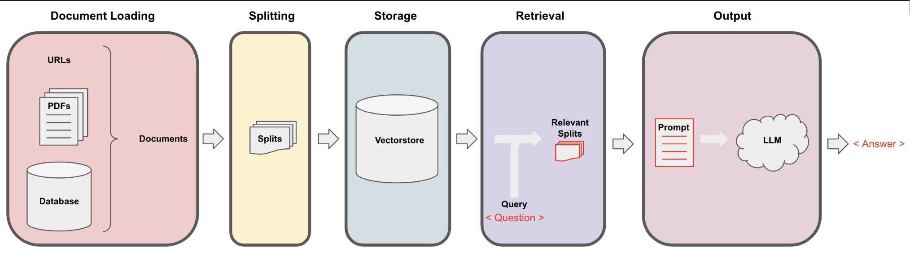
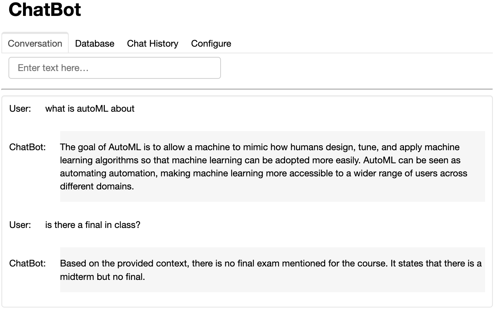
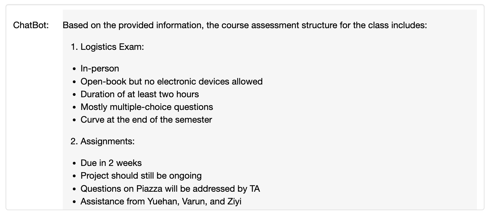

## Retrieval Augumented Generation

Utilizing the LangChain framework[1](##Reference), I made use of the Retrieval Augumented Generation workflow[2](#Reference)
to make a personalized chatbot proficient in accurately answering questions by accessing information in its 
vector store. 

### Sample Outputs

## References
1. [LangChain](https://python.langchain.com/docs/get_started/introduction)
2. [Retrieval-Augmented Generation for Knowledge-Intensive NLP Tasks
](https://arxiv.org/pdf/2005.11401.pdf), H. Lewis *et al*

